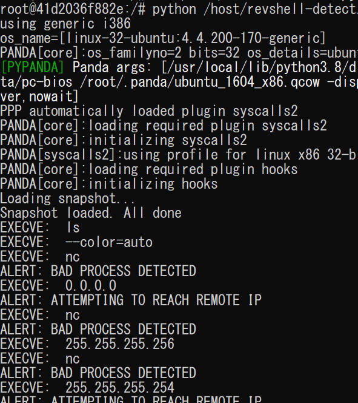

# socket-redirect
A python script to alter socket connect syscalls using Panda. This was made for a course on System Security and Dynamic Program Analysis taught by Andrew Fasano.

Background information on Panda available here.
https://github.com/panda-re/panda

My scripts are meant to be used to detect and redirect reverse shells being run within a panda recording. I made and tested these in a docker container with Panda. Over the past year I've been trying to study for the OSCP exam. In most of the challenges made to prepare for that exam the end goal is to get a reverse shell from the target computer. The term 'reverse shell' is very broad, and could mean many different things. Trying to detect them all would be very difficult. That said, when trying to analyze malware it may be useful to see what information the program is trying to send out without actually allowing it to reach its desired remote server. The solution I ended up coming to is to alter system calls on a system as it attempts to reach a remote IP and change the destination. Panda is a perfect tool for this as defining a callback for a given syscall is a simple process. 

## revshell-detect.py
revshell-detect.py is a more naive approach that I abandoned because I think it's more worthwhile to analyze arguments passed to `connect()` syscalls than process names through `execve()` syscalls. revshell-detect.py works but really just looks for processes like netcat or telnet being started and whether the arguments contain an IP address. It uses a regular expression to check for 4 0-255 numbers separated by periods. The python script runs a few commands to demonstrate the functionality


## netjail.py
This script is what I will be trying to improve in the coming weeks. I believe that it is written correctly, but I have not yet been able to make an adequate program to test and demonstrate its functionality. The script defines a panda callback on the start of every socket `connect()` syscall
connect is defined in the man page as follows:
```
int connect(int sockfd, const struct sockaddr *addr,
                   socklen_t addrlen);
```
[man page](https://man7.org/linux/man-pages/man2/connect.2.html)
the sockaddr_in struct is defined as:
```
struct sockaddr_in {
    short            sin_family;   // e.g. AF_INET
    unsigned short   sin_port;     // e.g. htons(3490)
    struct in_addr   sin_addr;     // see struct in_addr, below
    char             sin_zero[8];  // zero this if you want to
};

struct in_addr {
    unsigned long s_addr;  // load with inet_aton()
};
```
[man_page](https://www.gta.ufrj.br/ensino/eel878/sockets/sockaddr_inman.html)
My script simply reads these values in from the [virtual memory](https://docs.panda.re/index.html#pandare.Panda.virtual_memory_read), provides a simple avenue to change the destination port and address, and [writes](https://docs.panda.re/index.html#pandare.Panda.virtual_memory_write) them back to allow the socket to connect to this new destination.
Here's an example of how it works with `virtual_memory_read()`
```
        sockfd = panda.virtual_memory_read(cpu, argv_ptr, 4, fmt='int')
        sockaddr_fam = panda.virtual_memory_read(cpu, argv_ptr+4, 2, fmt='int')
        sockaddr_port = panda.virtual_memory_read(cpu, argv_ptr+6, 2, fmt='int')
        sockaddr_addr = panda.virtual_memory_read(cpu, argv_ptr+8, 4, fmt='int')
        sockaddr_zero = panda.virtual_memory_read(cpu, argv_ptr+12, 8, fmt='str')
```

As I am inexperienced with C and any quirks that may exist when trying to do networking with panda, the attempts I've made to write a program to test this with have failed. In the coming weeks I hope to figure this issue out and finish this project so it could be used by other people. 

## Note for anyone hoping to utilize this script
At the top of the script there are a few variables to take note of
`approved_addrs`: This should be a list of addresses to ignore in the analysis. This script will hook into _every_ call to `connect()`. There may be non malicious calls even in a malicious program, or calls that you still need to allow to go through so I figured leaving an option for ignoring addresses would be simplest.
`redirect_addr` and `redirect_port`: the address and port you wish to send the connection to.
